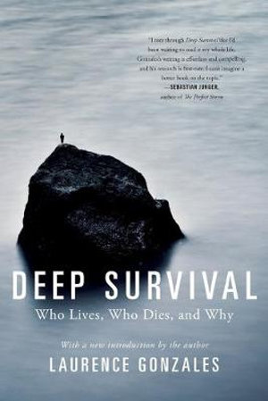
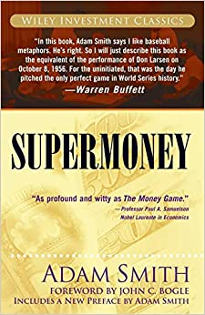
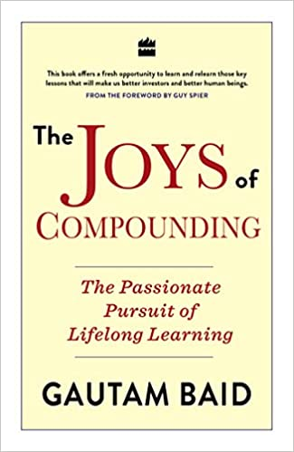
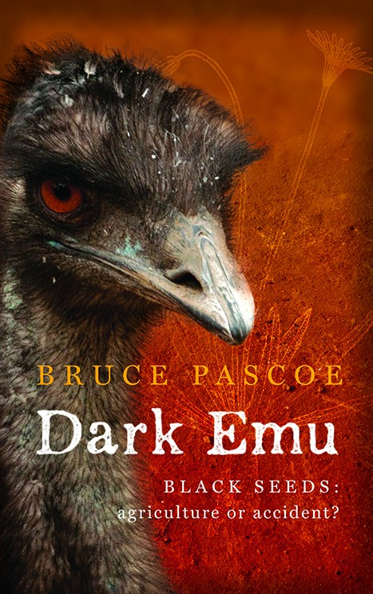

# Bookshelf

Leave me alone with a book and the concept of time goes into a state of non-existence for me.

I enjoy reading books on anything and everything. Some of my favourite subjects are

1. Finance and Investments
2. Business
3. History
4. Technology (Mostly computers and programming)
5. Biographies (Technically not a subject)
6. Classics

## My rating system

Life changing

Excellent read

Good

Meh

Don't bother

## Books I am reading

- 
Deep Survival: Who Lives, Who Dies and Why by [Laurence Gonzales](https://www.goodreads.com/author/show/37584.Laurence_Gonzales)

- 
Supermoney by [Adam Smith](https://www.goodreads.com/author/show/5761714.George_Goodman)

-  
The Joys of Compounding: The Passionate Pursuit of Lifelong Learning by [Gautam Baid](https://www.goodreads.com/author/show/18960770.Gautam_Baid)

## Books I plan to read

- The People's Tycoon: Henry Ford and the American Century - Steven Watts
- How to Measure Anything: Finding the Value of “Intangibles” in Business – Douglas W. Hubbard
- The Soul of a Woman – Isabel Allende
- Laziness Does Not Exist – Devon Price
- His Truth Is Marching On: John Lewis and the Power of Hope – Jon Meacham
- Candide – Voltaire
- Mastermind – Maria Konnikova
- The Confidence Game – Maria Konnikova
- What to Expect When You’re Expecting Robots – Laura Major and Julie Shah
- My Robot Gets Me – Carla Diana

## Incomplete list of Books I have read

## History

-  
[Dark Emu](/books/dark-emu) by [Bruce Pascoe](https://www.goodreads.com/author/show/809165.Bruce_Pascoe) 
This book presents a view that Australian Aborigines were more than hunter gatherers. They were skilled in agriculture, fishing, building homes for themselves and pretty much did all those things which are expected from a civilized society.

